# Contributing

This guide covers model training, architecture details, hyperparameter tuning, development workflow, and how to contribute.

## Development setup

### Cloning repository

```sh
git clone https://github.com/jhlopen/verito.git
cd verito
```

### Install dependencies (including dev dependencies)

```sh
uv sync --all-groups
```

### Linting and Formatting

```sh
uv run ruff check
uv run ruff format
```

### Testing

```sh
uv run pytest
```

Tests cover:

- Custom metric calculations
- Class weight computation
- Image loading and preprocessing

### Commit Convention

This project follows [Conventional Commits](https://www.conventionalcommits.org/) specification for commit messages.

**Format:**

```
<type>: <description>

[optional body]

[optional footer(s)]
```

**Types:**

- `feat`: A new feature
- `fix`: A bug fix
- `docs`: Documentation only changes
- `style`: Changes that don't affect code meaning (formatting, whitespace)
- `refactor`: Code change that neither fixes a bug nor adds a feature
- `perf`: Performance improvements
- `test`: Adding or updating tests
- `chore`: Changes to build process, dependencies, or tooling

**Examples:**

```sh
# Feature
git commit -m "feat: add threshold tuning script"

# Bug fix
git commit -m "fix: correct class weight calculation"

# Documentation
git commit -m "docs: update README with example output"

# Refactoring
git commit -m "refactor: extract metrics calculation to separate module"

# Testing
git commit -m "test: add unit tests for image loading"

# Chores
git commit -m "chore: update dependencies to latest versions"
```

**Guidelines:**

- Use lowercase for type and description
- Keep description under 72 characters
- Use imperative mood ("add" not "added" or "adds")
- Don't end description with a period
- Provide body for complex changes explaining what and why (not how)

## Project Structure

```
verito/
├── scripts/                   # Entry points
│   ├── train.py               # Training script
│   ├── detect.py              # Detection script
│   └── tune.py                # Threshold analysis script
├── verito/                    # Core package (importable)
│   ├── __init__.py            # Package exports
│   ├── model.py               # Model architecture
│   ├── data.py                # Data loading & preprocessing
│   └── metrics.py             # Evaluation metrics
├── tests/                     # Unit tests
│   ├── conftest.py            # Pytest fixtures
│   ├── test_metrics.py
│   ├── test_class_weights.py
│   └── test_image_loading.py
├── datasets/                  # Training & test data
│   ├── train/
│   │   ├── Fraud/
│   │   └── Non-Fraud/
│   └── test/
│       ├── Fraud/
│       └── Non-Fraud/
├── models/                    # Trained models & training reports
│   ├── verito.keras
│   └── 20251119T133742/       # Timestamped training reports
│   └── ...
├── STYLE.md                   # Style guide
├── CONTRIBUTING.md            # Developer guide
└── README.md                  # Overview and usage guide
```

### Code Organization

**Core package (`verito/`)**:

- `model.py` - Model architecture and loading
- `data.py` - Data generators, class weights, image loading
- `metrics.py` - Metric calculation and reporting
- `__init__.py` - Package exports

**Scripts (`scripts/`)**:

- Standalone executables
- Import from core package
- Handle CLI arguments (argparse)
- User-facing output

## Model Architecture

```mermaid
flowchart TD
    A["Input<br/>480×480×3"] --> B["EfficientNetV2L Base<br/>(pretrained ImageNet)"]
    B --> C["GlobalAveragePooling2D"]
    C --> D["BatchNormalization"]
    D --> E["Dense(256, relu)<br/>Dropout(0.5)"]
    E --> F["Dense(128, relu)<br/>Dropout(0.25)"]
    F --> G["Dense(1, sigmoid)<br/>Output: [0, 1] probability"]
```



**Key specifications:**

- Total parameters: ~120M
- Resolution: 480×480
- Model size: ~450MB
- Batch size: 16
- Trainable (Phase 1): ~364K (only classification head)
- Trainable (Phase 2): ~120M (full model)

### Design Decisions

1. **EfficientNetV2L**: High capacity for detailed analysis

   - Large model (120M params) provides superior feature extraction
   - Better accuracy for complex forgery detection
   - Optimal for detailed image analysis at higher resolutions

2. **480×480 Resolution**: Balanced detail and efficiency

   - Good detail capture while maintaining reasonable memory usage
   - Enables efficient batch sizes (16) for gradient stability
   - Good balance of computational efficiency and accuracy

3. **Classification Head**:
   - Two dense layers (256 → 128) with dropout
   - Sufficient capacity for binary classification
   - Regularization prevents overfitting

## Training Strategy

### Two-Phase Training

**Phase 1: Frozen Base (15 epochs)**

- Freeze EfficientNetV2L base
- Train classification head only (~364K params)
- Learning rate: 0.001
- Fast adaptation to fraud detection task
- Early stopping patience: 8 epochs

**Phase 2: Fine-tuning (25 epochs)**

- Unfreeze entire model (~120M params)
- Learning rate: 0.00001 (100x lower)
- Refine deep features for fraud patterns
- Early stopping patience: 8 epochs

**Why two phases?**

1. Faster convergence - classification head learns first
2. Prevents catastrophic forgetting - pretrained weights preserved
3. Better final accuracy - deep refinement in Phase 2

### Class Imbalance Handling

**The Problem:** Training data has severe imbalance (25:1 ratio)

- Non-Fraud: ~5,000 images
- Fraud: ~200 images

Without handling, model predicts "Non-Fraud" for everything.

**Solution: 3x Boosted Class Weights**

- 1x: Model ignores fraud class
- 2x: Slight improvement, insufficient
- **3x: Model learns to detect fraud** ✅
- 5x+: Too many false positives

### Data Augmentation

```python
# Training data generator
ImageDataGenerator(
    rescale=1./255,
    rotation_range=20,        # ±20° rotation
    width_shift_range=0.2,    # 20% horizontal shift
    height_shift_range=0.2,   # 20% vertical shift
    shear_range=0.2,
    zoom_range=0.2,
    horizontal_flip=True,
    fill_mode='nearest',
    validation_split=0.2      # 20% for validation
)
```

**Effect:** Increases effective fraud dataset from 200 → ~2000 variations

**Validation data:** No augmentation (only rescaling) for unbiased evaluation

### Best Practices

1. **Always use real ground truth for evaluation** - Don't rely solely on predictions
2. **Monitor false positive rate** - Too many false alarms reduces trust
3. **Regularly retrain** - Add new fraud patterns to training set
4. **Use appropriate threshold** - Balance based on business needs
5. **Manual review for edge cases** - Especially when model confidence is near threshold

## ⚙️ Hyperparameters

### Current Configuration

```python
# Resolution
TARGET_SIZE = (480, 480)
BATCH_SIZE = 16

# Training duration
EPOCHS_PHASE1 = 15
EPOCHS_PHASE2 = 25
PATIENCE = 8  # Early stopping

# Learning rates
LR_PHASE1 = 0.001   # Classification head
LR_PHASE2 = 0.00001 # Full model (100x lower)

# Regularization
DROPOUT_1 = 0.5     # After first dense layer
DROPOUT_2 = 0.25    # After second dense layer
VALIDATION_SPLIT = 0.2
```

### Tuning Guide

#### If Fraud Recall Too Low (< 60%)

1. **Increase class weight boost**

   ```python
   # In verito/data.py
   calculate_class_weights(train_gen, boost_factor=4.0)  # or 5.0
   ```

2. **Lower inference threshold**

   ```sh
   # Use tune.py to find data-driven optimal
   uv run scripts/tune.py
   ```

3. **Extend training**

   ```python
   EPOCHS_PHASE1 = 20
   EPOCHS_PHASE2 = 30
   PATIENCE = 15
   ```

4. **Increase augmentation**
   ```python
   rotation_range=30,
   width_shift_range=0.3,
   height_shift_range=0.3
   ```

#### If Too Many False Positives

1. **Decrease class weight boost**

   ```python
   calculate_class_weights(train_gen, boost_factor=2.0)
   ```

2. **Raise inference threshold**

   ```sh
   # Use tune.py to analyze
   uv run scripts/tune.py
   ```

3. **Add more regularization**

   ```python
   DROPOUT_1 = 0.6  # Increase from 0.5
   DROPOUT_2 = 0.3  # Increase from 0.25
   ```

4. **Reduce augmentation** (if model is underfitting non-fraud)
   ```python
   rotation_range=15,
   width_shift_range=0.15
   ```

#### If Training Too Slow

1. **Reduce resolution**

   ```python
   TARGET_SIZE = (224, 224)  # Trade accuracy for speed
   ```

2. **Increase batch size** (if GPU memory allows)

   ```python
   BATCH_SIZE = 32
   ```

3. **Reduce epochs**
   ```python
   EPOCHS_PHASE1 = 10
   EPOCHS_PHASE2 = 15
   ```

#### If Out of Memory (OOM)

1. **Reduce batch size**

   ```python
   BATCH_SIZE = 8
   ```

2. **Reduce resolution**
   ```python
   TARGET_SIZE = (224, 224)
   ```

## Training Runs & Reports

### Automatic Report Generation

Every training run automatically generates a comprehensive report with visualizations and analysis.

**Directory structure:**

```
models/
├── verito.keras                # Trained model (always at root)
├── 20251119T133742/            # ISO 8601 timestamped run
│   ├── REPORT.md               # Training report
│   ├── history.json            # Raw training data
│   ├── loss_curves.png         # Loss with best epoch
│   ├── accuracy_curves.png     # Accuracy trends
│   ├── precision_curves.png    # Precision (false positive rate)
│   └── recall_curves.png       # Recall (fraud detection rate)
└── 20251119T164510/            # Another run
    └── ...
```

### What's in REPORT.md

The automatically generated report includes:

1. **Configuration**: All hyperparameters used
2. **Final Results**: Validation metrics from final and best epochs
3. **Training Curves**: Loss, accuracy, precision, recall
4. **Epoch-by-Epoch History**: Complete training log table
5. **Analysis**: Automatic detection of overfitting, underfitting
6. **Recommendations**: Suggestions based on metrics

### Accessing Training History

**View a training report:**

Navigate to any timestamped directory like `models/20251119T133742/REPORT.md`

**Load history for analysis:**

```python
import json
from pathlib import Path

# Load a specific run
with open("models/20251119T133742/history.json") as f:
    history = json.load(f)

# Access metrics
val_losses = history['val_loss']
val_recalls = history['val_recall']

# Find best epoch
best_epoch = val_losses.index(min(val_losses)) + 1
print(f"Best epoch: {best_epoch}")
print(f"Best val_loss: {min(val_losses):.4f}")
```

**Compare multiple runs:**

```python
from pathlib import Path
import json

runs_dir = Path("models")
runs = [d for d in runs_dir.iterdir() if d.is_dir() and d.name.startswith("20")]

for run in sorted(runs):
    with open(run / "history.json") as f:
        history = json.load(f)

    best_val_loss = min(history['val_loss'])
    final_val_recall = history['val_recall'][-1]

    print(f"{run.name}: val_loss={best_val_loss:.4f}, recall={final_val_recall:.3f}")
```

### Visualizations Generated

Four standalone plots, each with dedicated analysis in `REPORT.md`:

**1. loss_curves.png**

- Training vs validation loss
- Best epoch marker (red line)
- For detecting overfitting/underfitting

**2. accuracy_curves.png**

- Training vs validation accuracy
- 85% target line (green)
- Overall correctness metric

**3. precision_curves.png**

- Training vs validation precision
- 75% target line (green)
- Measures false positive rate

**4. recall_curves.png**

- Training vs validation recall
- 70% target line (green)
- Measures fraud detection rate
- Critical for fraud detection performance

## Finding Optimal Threshold

**Important:** The classification threshold is NOT used during training - only for inference.

After training, use the threshold finder script:

```sh
uv run scripts/tune.py \
  --fraud-dir datasets/test/Fraud \
  --authentic-dir datasets/test/Non-Fraud
```

**Output:**

- Tests thresholds from 0.1 to 0.9
- Shows metrics for each threshold
- Recommends optimal thresholds for different objectives:
  - **Balanced (best F1)**: General-purpose
  - **High Recall**: Catch more fraud (tolerate false positives)
  - **High Precision**: Fewer false alarms (may miss some fraud)
  - **ROC-Optimized**: Theoretical optimal
- Creates visualization plot

## 🎨 Code Style

See [STYLE.md](STYLE.md) for detailed style guidelines covering:

- User-facing messaging conventions
- Output formatting
- Documentation style
- For both humans and AI agents

## Writing New Tests

Follow existing patterns:

```python
def test_custom_logic():
    """Test description."""
    # Arrange
    input_data = ...

    # Act
    result = your_function(input_data)

    # Assert
    assert result == expected_value
```

Use fixtures from `conftest.py`:

- `temp_dataset_dir` - Temporary dataset structure
- `simple_model` - Lightweight model for testing
- `temp_image` - Single test image

## Alternative Approaches

### Different Base Models

You can experiment with other EfficientNet variants:

```python
# In verito/model.py
from tensorflow.keras.applications import (
    EfficientNetV2S,  # Small (22M params)
    EfficientNetV2M,  # Medium (54M params)
    EfficientNetV2L,  # Current (120M params)
)

base_model = EfficientNetV2L(
    include_top=False,
    weights='imagenet',
    input_shape=(480, 480, 3)
)
```

### Custom Head Architecture

```python
# More layers for complex patterns
x = Dense(512, activation='relu')(x)
x = Dropout(0.5)(x)
x = Dense(256, activation='relu')(x)
x = Dropout(0.3)(x)
x = Dense(128, activation='relu')(x)
x = Dropout(0.25)(x)

# Simpler head for faster training
x = Dense(128, activation='relu')(x)
x = Dropout(0.4)(x)
```

## Additional Resources

- **Architecture**: [EfficientNet Paper](https://arxiv.org/abs/1905.11946)
- **Architecture**: [EfficientNetV2 Paper](https://arxiv.org/abs/2104.00298)
- **Class Imbalance**: [Google ML Guide](https://developers.google.com/machine-learning/data-prep/construct/sampling-splitting/imbalanced-data)
- **Transfer Learning**: [TensorFlow Guide](https://www.tensorflow.org/tutorials/images/transfer_learning)
