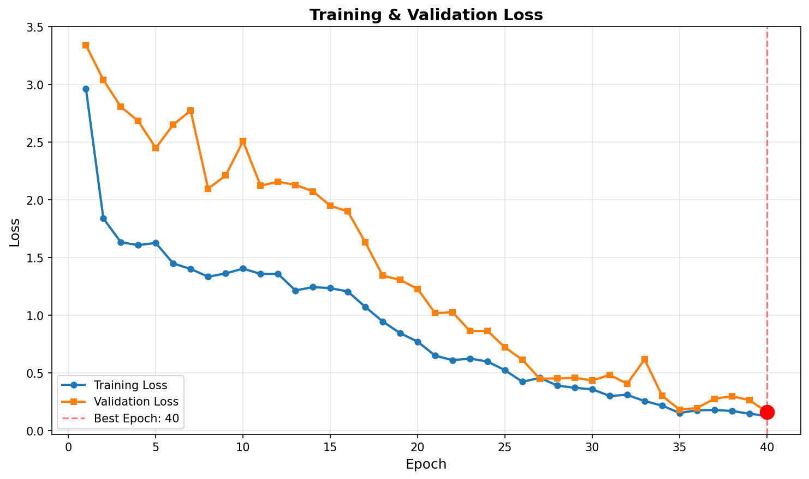
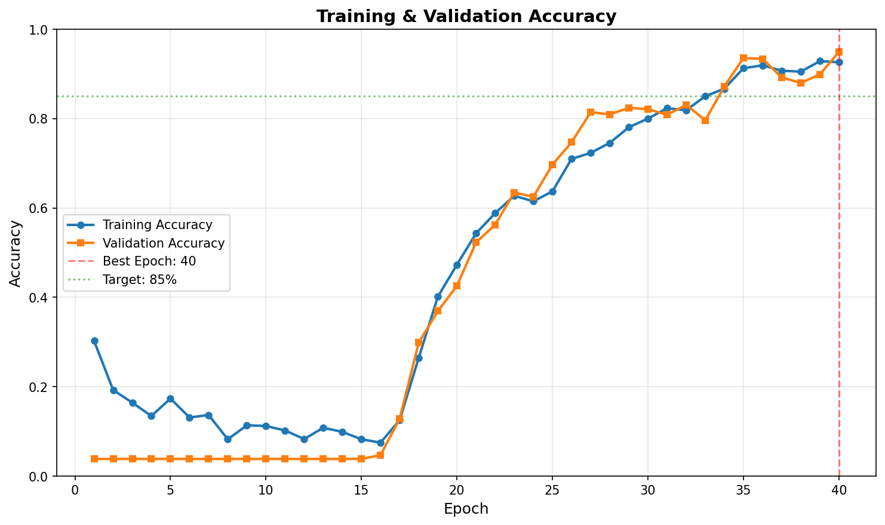
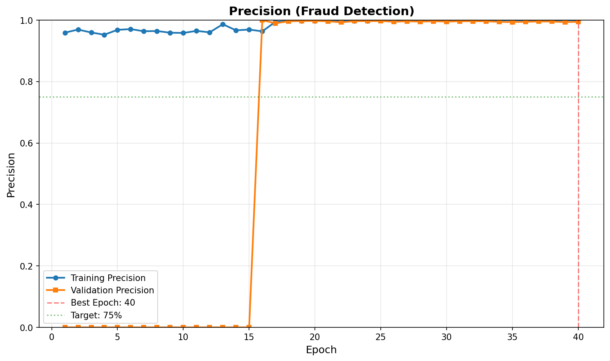
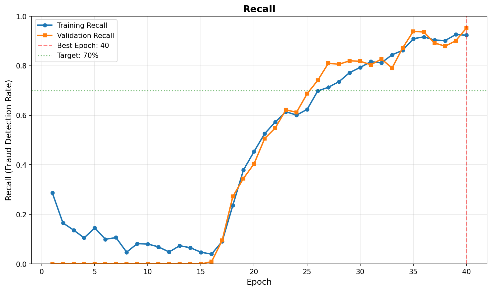

# Training Report

**Date**: 2025-11-22 11:50:13 UTC  
**Total Training Time**: 3920.3 minutes (235219 seconds)  
**Total Epochs**: 40  
**Best Epoch**: 40 (based on validation loss)

---

## Configuration

### Model Architecture
- Base Model: EfficientNetV2L
- Input Size: (480, 480)
- Total Parameters: ~120M
- Trainable (Phase 1): ~364K
- Trainable (Phase 2): ~120M

### Training Parameters
- Batch Size: 16
- Phase 1 Epochs: 15
- Phase 2 Epochs: 25
- Early Stopping Patience: 8
- Learning Rate (Phase 1): 0.001
- Learning Rate (Phase 2): 1e-05

### Data
- Training Samples: 4160
- Validation Samples: 1040
- Class Weight Boost: 3.0x
- Validation Split: 20%

---

## Final Results

### Validation Metrics (Final Epoch)

| Metric | Value |
|--------|-------|
| Loss | 0.1626 |
| Accuracy | 94.90% |
| Precision | 99.48% |
| Recall (Fraud Detection) | 95.20% |

### Best Performance (Epoch 40)

| Metric | Value |
|--------|-------|
| Validation Loss | 0.1626 |
| Validation Accuracy | 94.90% |
| Validation Precision | 99.48% |
| Validation Recall | 95.20% |

---

## Training Progress

### 1. Loss Curves



**What to look for:**
- Both training and validation loss should **decrease steadily**
- If validation loss increases while training loss decreases → **overfitting**
- If both plateau early → **underfitting** (train longer or increase capacity)
- Best model was saved at **Epoch 40** (marked with red line)

**Current status:** Best validation loss = `0.1626` at epoch 40

---

### 2. Accuracy Curves



**What it means:**
- **Accuracy** = (Correct predictions) / (Total predictions)
- Target: **85-90%** for production use
- Final validation accuracy: **94.90%**

**Note:** Accuracy can be misleading with class imbalance (25:1 ratio). Precision and recall are more informative for fraud detection.

---

### 3. Precision Curves



**What it means:**
- **Precision** = (True fraud detected) / (All flagged as fraud)
- Measures **false positive rate** - how many false alarms
- Target: **70-85%** (balance between catching fraud and review workload)
- Final validation precision: **99.48%**

**Impact:** Lower precision = more manual reviews of false positives

---

### 4. Recall Curves



**What it means:**
- **Recall** = (True fraud detected) / (All actual fraud)
- Measures **fraud detection rate** - how many fraud cases we catch
- Target: **60-80%** (higher is better, but harder with subtle forgeries)
- Final validation recall: **95.20%**

**Impact:** This is the most critical metric for fraud detection. Low recall means we're missing fraud cases!

**Why recall matters most:** Missing a fraud case (false negative) costs much more than a false alarm (false positive).

---

## Epoch-by-Epoch History

| Epoch | Train Loss | Val Loss | Train Acc | Val Acc | Val Precision | Val Recall |
|-------|------------|----------|-----------|---------|---------------|------------|
|  1 | 2.9638 | 3.3402 | 0.303 | 0.038 | 0.000 | 0.000 |
|  2 | 1.8394 | 3.0397 | 0.193 | 0.038 | 0.000 | 0.000 |
|  3 | 1.6330 | 2.8062 | 0.164 | 0.038 | 0.000 | 0.000 |
|  4 | 1.6078 | 2.6826 | 0.135 | 0.038 | 0.000 | 0.000 |
|  5 | 1.6268 | 2.4495 | 0.174 | 0.038 | 0.000 | 0.000 |
|  6 | 1.4490 | 2.6516 | 0.131 | 0.038 | 0.000 | 0.000 |
|  7 | 1.4012 | 2.7736 | 0.137 | 0.038 | 0.000 | 0.000 |
|  8 | 1.3340 | 2.0971 | 0.082 | 0.038 | 0.000 | 0.000 |
|  9 | 1.3622 | 2.2109 | 0.114 | 0.038 | 0.000 | 0.000 |
| 10 | 1.4044 | 2.5082 | 0.112 | 0.038 | 0.000 | 0.000 |
| 11 | 1.3583 | 2.1238 | 0.102 | 0.038 | 0.000 | 0.000 |
| 12 | 1.3592 | 2.1566 | 0.083 | 0.038 | 0.000 | 0.000 |
| 13 | 1.2150 | 2.1305 | 0.108 | 0.038 | 0.000 | 0.000 |
| 14 | 1.2440 | 2.0735 | 0.099 | 0.038 | 0.000 | 0.000 |
| 15 | 1.2350 | 1.9494 | 0.082 | 0.038 | 0.000 | 0.000 |
| 16 | 1.2060 | 1.8997 | 0.075 | 0.047 | 1.000 | 0.009 |
| 17 | 1.0728 | 1.6315 | 0.125 | 0.129 | 0.990 | 0.095 |
| 18 | 0.9464 | 1.3433 | 0.265 | 0.299 | 0.996 | 0.272 |
| 19 | 0.8447 | 1.3064 | 0.402 | 0.369 | 0.997 | 0.345 |
| 20 | 0.7715 | 1.2285 | 0.473 | 0.426 | 0.998 | 0.404 |
| 21 | 0.6504 | 1.0186 | 0.543 | 0.523 | 0.996 | 0.506 |
| 22 | 0.6111 | 1.0259 | 0.588 | 0.562 | 0.993 | 0.549 |
| 23 | 0.6243 | 0.8634 | 0.627 | 0.635 | 0.997 | 0.622 |
| 24 | 0.5990 | 0.8638 | 0.615 | 0.625 | 0.997 | 0.612 |
| 25 | 0.5243 | 0.7227 | 0.637 | 0.697 | 0.997 | 0.687 |
| 26 | 0.4236 | 0.6136 | 0.710 | 0.747 | 0.995 | 0.741 |
| 27 | 0.4581 | 0.4502 | 0.723 | 0.814 | 0.996 | 0.810 |
| 28 | 0.3910 | 0.4528 | 0.746 | 0.810 | 0.995 | 0.806 |
| 29 | 0.3715 | 0.4582 | 0.781 | 0.824 | 0.996 | 0.820 |
| 30 | 0.3591 | 0.4348 | 0.800 | 0.821 | 0.995 | 0.818 |
| 31 | 0.3009 | 0.4835 | 0.823 | 0.809 | 0.996 | 0.804 |
| 32 | 0.3103 | 0.4066 | 0.819 | 0.831 | 0.996 | 0.827 |
| 33 | 0.2563 | 0.6183 | 0.850 | 0.796 | 0.996 | 0.791 |
| 34 | 0.2174 | 0.3032 | 0.867 | 0.872 | 0.994 | 0.872 |
| 35 | 0.1536 | 0.1825 | 0.913 | 0.936 | 0.994 | 0.939 |
| 36 | 0.1769 | 0.1962 | 0.919 | 0.934 | 0.995 | 0.936 |
| 37 | 0.1792 | 0.2769 | 0.907 | 0.892 | 0.996 | 0.892 |
| 38 | 0.1708 | 0.2982 | 0.905 | 0.880 | 0.995 | 0.879 |
| 39 | 0.1471 | 0.2649 | 0.929 | 0.899 | 0.993 | 0.901 |
| 40 | 0.1283 | 0.1626 | 0.926 | 0.949 | 0.995 | 0.952 | ⭐ Best

---

## Analysis

### Training Stability

✅ **Good Balance**: Training and validation losses are close, indicating good generalization.

✅ **Good Recall (95.2%)**: Model is detecting most fraud cases.

✅ **Good Precision (99.5%)**: False positive rate is acceptable.


### Recommendations

Based on the training results:

1. **Model Performance**: Model meets target metrics. Ready for deployment.

2. **Next Steps**:
   - Run detection on test set: `uv run scripts/detect.py --forged-dir datasets/test/Fraud --authentic-dir datasets/test/Non-Fraud`
   - Find optimal threshold: `uv run scripts/tune.py`
   - If needed, adjust hyperparameters and retrain

---

## Files in This Run

- `REPORT.md` - This report
- `history.json` - Raw training history data
- `loss_curves.png` - Loss visualization
- `accuracy_curves.png` - Accuracy visualization
- `precision_curves.png` - Precision visualization
- `recall_curves.png` - Recall visualization
- `../verito.keras` - Trained model file (at models/ root, 1351.8 MB)

---

## How to Use This Model

```sh
# Run detection
uv run scripts/detect.py \
  --forged-dir datasets/test/Fraud \
  --authentic-dir datasets/test/Non-Fraud \
  --model-path models/verito.keras

# Find optimal threshold
uv run scripts/tune.py \
  --model-path models/verito.keras
```

---

*Report generated automatically by training script*
